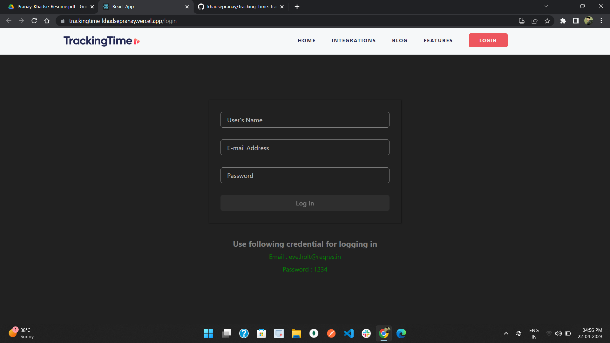

# Tracking Time
Got an Individual project to clone Tracking Time website. I have completed this project within 4 days.
Tracking Time is a time tracker website, where you can see how much time you spend on each task or project! TrackingTime's integrations make it easy to keep track of your billable and non-billable tasks by integrating with more than 30 apps. Time Tracking will help you improve your time tracking and increase your productivity with these Integrations.

In this project, I have made the following things :
 - Log In Page
 - Navbar
 - Home Page
 - Integration Page
 - Blog Page
 - Footer Page

---

### [click here to run live demo](https://aesthetic-tartufo-d0e8be.netlify.app/)

## Tech stacks used :
* **HTML**
* **CSS**
* **JavaScript**
* **React**
* **Chakra UI**

***
## Landing Page :

## Log In page :

## Integration Page:

## Blog Page : 

## Footer Page :

## Learnings :
- Real-life implementation of React,Router,Context-Provider,Chakra-UI.
- Time-management and Accountability.
- Learn to work in pressure.
- Learn to tackle problems and how to keep my-self motivated.

